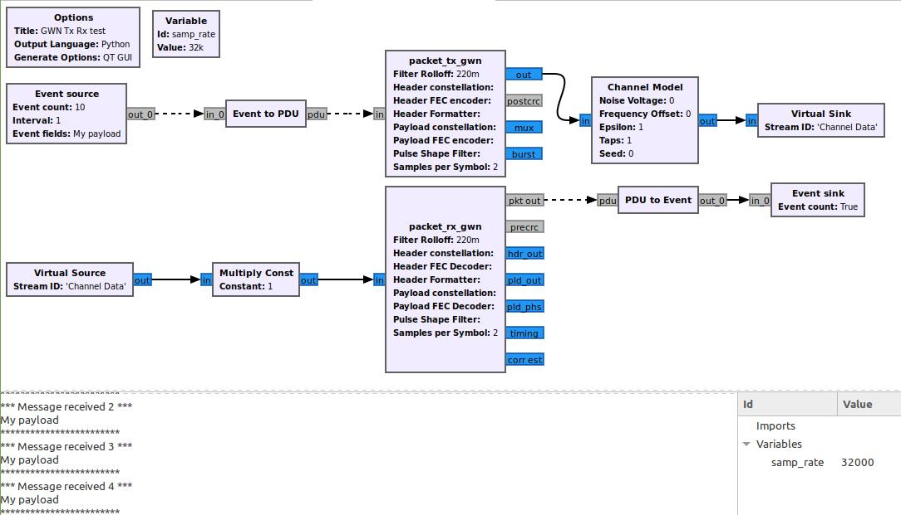

# GWN3 : GNU Wireless Network 3

GWN, the GNU Wireless Network, is a network development toolkit compatible with GNU Radio. GWN3 is the GNU Wireless Network version 3, coded in Python 3.

The GNU Wireless Network project (GWN) is a toolkit to allow teaching and experimentation in wireless data networks. It is conceived as an out-of-tree module of GNU Radio, a popular Software Defined Radio (SDR) implementation. GWN is based on the tagged streams and messages of GNU Radio which allow asynchronous item transfer among blocks, and message passing to blocks upstream in the flowgraph. GWN adds some other features essential to data network protocol implementation, such as timers on each block, and access to a finite state machine.

The GWN toolkit comes with some blocks which implement atomic functions frequently used in data network protocol implementation. 

A new GWN block may be easily created by a script called `gwn_modtool`, the equivalent of `gr_modtool` in GNU Radio. The script is invoked indicating the number of input ports, output ports, timers and timeout functions, plus a user defined list of parameters. Functionality of the new block may be added by editing the code of the `process_data` function inside the block.

GWN provides a template block with a Finite State Machine (FSM), which can be used to create a complementary block and associate it to the new block. This allows for an easy way to extend GWN with new blocks apt for data network communications.

The GWN toolkit was tested in real world communication among computers using USRP hardware devices.

## An example flowgraph

The following example flowgraph shows transmission and reception of a data packet through a Channel Model block. For real air transmission, blocks Virtual Sink and Virtual Source can be substituted by blocks which act as interfaces to real transmission and reception hardware, such as USRP devices. In such case, the Channel Model block becomes unnecessary.

## History

Ths project started several years ago, evolutioning through different stages. The first complete version was gr-gwn, _GNU Radio GNU Wireless Network_, coded in Python 2. A subsequent version, called [gr-gwncppvgb](https://github.com/vagonbar/gr-gwncppvgb) was a port to C++ with some extensions, allowing for the addition of new blocks coded in C++ or Python. GNU Radio imposes limitations on C++ inheritance, which makes development in C++ more difficult and involved. This proved to be a significant drawback for using this toolkit in teaching and prototyping. _GWN3, GNU Wirelss Network version 3_, the present version, is coded in Python 3, which is now the default in GNU Radio. This version includes enhancements and improvements added to the C++ version plus some further additions, thus becoming the most mature and up-to-date version. 

## Documentation

- [Quick start](libgwn/docs/QuickStart.md)
- [Standard blocks](libgwn/docs/StandardBlocks.md)
- [Installation](libgwn/docs/Installation.md)
- [GWN block characteristics](libgwn/docs/GWN3Block.md)
- [Creating a new GWN block](libgwn/docs/NewBlock.md)
- [FSM, Finite State Machine](libgwn/docs/FSM.md)
- [GNU Radio packet blocks](libgwn/docs/GR_packet.md)
- [Stop and Wait network protocol FSM blocks](libgwn/StopAndWaitFSM.md)
- [Code documentation](https://htmlpreview.github.io/?https://github.com/vagonbar/gr-gwn3/blob/master/libgwn/html/index.html)

## Publications

* V. González-Barbone, P. Belzarena, and F. Larroca. _Software Defined Radio: From Theory to Real World Communications_. Proc. IEEE Technologies Applied to
Electronics Teaching Conf., Tenerife, Spain, 20–22 June 2018.

* Víctor González Barbone, Pablo Belzarena, Federico Larroca, Martín Randall, Paola Romero, Mariana Gelós. _GWN : A framework for packet radio and medium access control in GNU radio_.   Wireless Innovation Forum Conference on Wireless Communications Technologies and Software Defined Radio (WInnComm 17), San Diego, CA, USA, 13-17 nov, page 1--10 - 2017 [PDF](https://iie.fing.edu.uy/publicaciones/2017/GBLRRG17/GBLRRG17.pdf)

