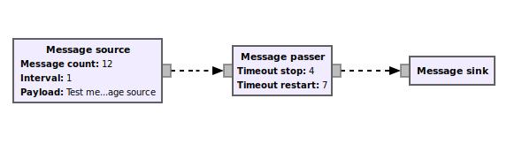

# GWN : GNU Wireless Network, version 3


GWN, the GNU Wireless Network, is a network development toolkit compatible with GNU Radio.

The main site of the project, [gr-gwncppvgb](https://github.com/vagonbar/gr-gwncppvgb) is developed both in Python and C++. GNU Radio imposes limitations on C++ inheritance, which makes development in C++ more difficult and involved. This is a significant drawback for using this toolkit in teaching and prototyping. In this site we are developing the project mainly in Python, specifically in Python 3, which will be de default in coming versions of GNU Radio.
The purpose of this site is then, twofold:
- to keep GWN simple to use and enhance with new user developed blocks.
- to bring the code to Python 3.

Please visit [gr-gwncppvgb](https://github.com/vagonbar/gr-gwncppvgb) for full documentation on the project.

Please consider this version as a work in progress.

## Installation

This version of GWN requires GNU Radio 3.8. The following instructions assume gr-gwn3 is cloned in the user's home directory under subdirectory ```~/GNURadio```, and GNU Radio 3.8 is installed in ```/home/gnuradio-3.8```, and ```/home/gnuradio-3.8/setup_env.sh``` has been sourced to make paths to GNU Radio available (command ```source /home/gnuradio-3.8/setup_env.sh``` or included in ```.bashrc``` file).

```
  cd
  cd GNURadio/gr-gwn3
  rm -rf build; mkdir build      # only to get rid of old builds
  cd build
  cmake -DCMAKE_INSTALL_PREFIX=/home/gnuradio-3.8 ../
  make
  make install
  python3 ../python/qa_msg_passer.py 
```

The last command runs a test on an example flowgraph involving three blocks:

```  msg_source --> msg_passer --> msg_sink```

The source block emits messages at regular intervals, the passer block allows them to pass for some time, interrupts passing for another interval, then restarts passing messages to the sink block, which receives the messages and shows their content.
This very simple flowgraph shows handling of GWN messages as Python dictionaries (may by other structures), the use of input and output ports to send and receive messages, and the use of timers and timeouts to generate the messages and to interrupt or continue passing them. These are the main features of GWN, the handling of data messages and the use of time, a feature not present in GNU Radio.

This flowgraph is available in GRC by opening  ```examples/msg_passer_example.grc```.



## Creating a new GWN block

After cloning this repository, a new GWN block can be easily created using Python script ```gwn_modtool_py.py```. This script must be executed from the ```build``` subdirectory of your project.

The following positional parameters may be given:

```<new_block_name> <nr_in> <nr_out> <nr_timers> <nr_timeouts>```

These indicate the new block name, and the numbers of input ports, output ports, timers and timeouts. If invoked with no positional parameters, the script will ask for them. These parameters define the new block construction; they are not visible to block users. 

Next, the script will ask for the new block's own parameters, a list of Python parameters such as 

```msg_count, interval=100, payload="an example payload"```

After confirmation, the script will create the new block, with all parameters included, for the programmer to customize. This typically includes:

- in the new block python code, code initialization in constructor and code for processing in the ```process_data``` function.
- in the new block QA, inports for additional blocks, adjustment of parameters, and interconneting blocks in a flowgraph to test the new block capabilities.
- to make the new block available in GRC (GNU Radio Companion), adjustment of the corresponding YAML file in the ```grc``` subdirectory.

For example, the block msg_passer was created with the following command:

```../libgwn/gwn_modtool_py.py msg_passer 1 1 0 2```

This indicates one input port, one output port, no timers, two timeouts. When the script asks for the blocks own parameters, the following was entered:

```tout_stop=5.0, tout_restart=8.0```

After confirmation, the script creates the new block through its files, with names and parameters as indicated by the user.

## Publications

* V. González-Barbone, P. Belzarena, and F. Larroca. _Software Defined Radio: From Theory to Real World Communications_. Proc. IEEE Technologies Applied to
Electronics Teaching Conf., Tenerife, Spain, 20–22 June 2018.

* Víctor González Barbone, Pablo Belzarena, Federico Larroca, Martín Randall, Paola Romero, Mariana Gelós. _GWN : A framework for packet radio and medium access control in GNU radio_.   Wireless Innovation Forum Conference on Wireless Communications Technologies and Software Defined Radio (WInnComm 17), San Diego, CA, USA, 13-17 nov, page 1--10 - 2017 [PDF](https://iie.fing.edu.uy/publicaciones/2017/GBLRRG17/GBLRRG17.pdf)

