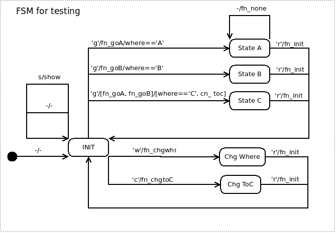

[GWN3, GNU Wireless Network 3](https://github.com/vagonbar/gr-gwn3)

# FSM, Finite State Machine


## The `gwnfsm` module

This module implements a Finite State Machine (FSM) engine. In addition to the usual states and transitions, the GWN FSM includes actions, memory, and conditions. 

An action is a user written function executed on a transition, before moving the machine to the next state.

Memory may be any object capable of recording and retrieving information, in whatever access mode the application may need (LIFO, FIFO, etc). The memory facility is not part of the FSM machine, but an independent object. Memory may be handled in the action functions.

A conditions is a user written function or expression which returns True or False when executed or evaluated. The action function and the transition are only executed if the condition evaluates to True. If the condition on a transition evaluates to False, the transition is not performed, and its related action is not executed.

The FSM is defined through tables of transitions. In a current state, for a given input symbol, the `process()` method uses these tables to decide which action to call and which the next state will be, if and only if the condition evaluates to True; otherwise, nothing happens.

The table of transitions defines the following associations:
```
(input_symbol, current_state) --> (action, next_state, condition)
```

where action is a function, symbols and states can be any objects (usually strings), and condition is a function or an expression which returns a boolean. This table is maintained through the FSM methods `add_transition()` and `add_transition_list()`.

A second table of transitions defines another kind of association:
```
(current_state) --> (action, next_state, condition)
```

This allows to add transitions valid for any input symbol. The table of any symbol transitions is maintained through the FSM method `add_transition_any()`.

The FSM has also one default transition not associated with any specific input symbol or state. The default transition matches any symbol on any state, and may be used as a catch-all transition. The default transition is set through the `set_default_transition()` method. There can be only one default transition.

On receiving a symbol, the FSM looks in the transition tables in the following order::

1. The transitions table for (input_symbol, current_state).
2. The transitions table for (current_state), valid for and any input symbol.
3. The default transition.
4. If no valid transition is found, the FSM will raise an exception.

Matched transitions with the former criteria may produce a list of (action, next_state, condition). The condition is evaluated for each tuple in the list, and the first tuple on which the condition is found True is executed, the action function is called, and the next state is set as the current state.

If no transition is defined for an input symbol, the FSM will raise an exception. This can be prevented by defining a default transition. 

The action function receives a reference to the FSM as a parameter, hence the action function has access to all attributes in the FSM, such as current_state, input_symbol and memory.

The GWN Finite State Machine implementation is an extension of [Noah Spurrier's FSM 20020822](http://www.noah.org/python/FSM/).

Please see the code documentation, in the FSM module, for a more detailed description.
- [Code documentation](https://htmlpreview.github.io/?https://github.com/vagonbar/gr-gwn3/blob/master/libgwn/html/index.html)


## The gwnfsm_test module

This module builds an FSM for testing. The example FSM is described in the following diagram.



The following commands run an FSM example test. The creation of the FSM machine acccording to the rules given in the example code is first described; then the user may input events (characters) to see the machine move from one state to the other. A sequence of symbols trying all the transitions may also be inserted all at once.

```
$ cd libgwn/fsm/
$ python3 gwnfsm_test_2.py 


=== FSM, Finite State Machine example ===
Input events (symbols, characters).
To test all functions at once, please input
    jsjsgrgjrwrsgrwrsgrcrsgrs
Some symbols produce no action, please see FSM diagram.
To finish, press Enter without any symbol.

--- FSM created, show state
    FSM initial_state: INIT
    FSM transitions:
      INIT --> s / fn_show [] --> INIT
      INIT --> g / fn_goA fn_goB [self.where=='C' cn_toc ] --> State C
      State A --> r / fn_init [] --> INIT
      State B --> r / fn_init [] --> INIT
      State C --> r / fn_init [] --> INIT
      INIT --> w / fn_chgwhr [] --> Chg Where
      INIT --> c / fn_chgtoC [] --> Chg ToC
      Chg Where --> r / fn_init [] --> INIT
      Chg ToC --> r / fn_init [] --> INIT
    FSM transitions for any symbol:
      INIT --> '' / '' + [] --> INIT
      State A --> '' / fn_none [] --> State A
    FSM default transition:
      '' --> '' / fn_error [] --> INIT

Event:
```
From this on, the user may insert characters one by one, several together, or the proposed sequence to test all transitions at once.

A very simple FSM can be tested by running the following example:

```
$ cd libgwn/fsm/
$ python3 fsmtest.py 
=== GWN FSM test
    1. To test all transitions.
    2. To input one symbol at a time.
    Opción: 1
GWN FSM test: print all transitions
    FSM initial_state: INIT
    FSM transitions:
      INIT --> a1 / fn_goA_1 [cn_1_true] --> State A
      State A --> i1 / fn_init [cn_2_true ] --> INIT
      INIT --> a2 / fn_goA_1 [cn_1_true cn_2_true ] --> State A
      State A --> i2 / fn_init [cn_1_true cn_2_true ] --> INIT
      INIT --> a3 / fn_goA_1 fn_goA_2 [cn_1_true ] --> State A
      State A --> i3 / fn_init [3 == 2] --> INIT
      State A --> i4 / fn_init [cn_3_false ] --> INIT
    FSM transitions for any symbol:
      INIT --> '' / fn_none [] --> INIT
    FSM default transition:
      '' --> '' / fn_error [] --> INIT

   FSM cn_1_true
   FSM fn_goA_1; symbol a1
      INIT --> a1 / fn_goA_1 [cn_1_true] --> State A
   FSM cn_2_true
   FSM fn_init; symbol i1
      State A --> i1 / fn_init [cn_2_true ] --> INIT
   FSM cn_1_true
   FSM cn_2_true
   FSM fn_goA_1; symbol a2
      INIT --> a2 / fn_goA_1 [cn_1_true cn_2_true ] --> State A
   FSM cn_1_true
   FSM cn_2_true
   FSM fn_init; symbol i2
      State A --> i2 / fn_init [cn_1_true cn_2_true ] --> INIT
   FSM cn_1_true
   FSM fn_goA_1; symbol a3
      INIT --> a3 / fn_goA_1 fn_goA_2 [cn_1_true ] --> State A
   FSM fn_goA_2; symbol a3
      INIT --> a3 / fn_goA_1 fn_goA_2 [cn_1_true ] --> State A
   FSM cn_3_false
   FSM cn_2_true
   FSM fn_init; symbol i1
      State A --> i1 / fn_init [cn_2_true ] --> INIT
```

[Back to README](../../README.md)
