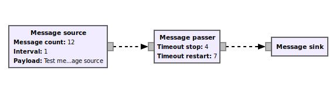

[GWN3, GNU Wireless Network 3](https://github.com/vagonbar/gr-gwn3)

# Installation

These notes offer some additional information on installation, as a complement to the [Quick Start page](QuickStart.md).

## GNU Radio

To install GNU Radio, plase see [InstallingGR](https://wiki.gnuradio.org/index.php/InstallingGR).

To install in a virtual machine, Linux Mint XFCE offers an Ubuntu based Linux installation with a light graphical environment, XFCE. 


## GWN

The following instructions assume `gr-gwn3` is cloned in the user's home directory under subdirectory `~/GNURadio`, and GNU Radio 3.9 has been installed as formerly indicated. 

```
  cd
  mkdir GNURadio
  cd GNURadio
  git clone https://github.com/vagonbar/gr-gwn3
  cd GNURadio/gr-gwn3
  rm -rf build; mkdir build      # only to get rid of old builds
  cd build
  cmake ../
  make
  sudo make install
  export PYTHONPATH=$PYTHONPATH:~/GNURadio/gr-gwn3
  python3 ../python/qa_msg_passer.py 
```

The last command runs a test on an example flowgraph involving three blocks:

```  msg_source --> msg_passer --> msg_sink```

The source block emits messages at regular intervals, the passer block allows them to pass for some time, interrupts passing for another interval, then restarts passing messages to the sink block, which receives the messages and shows their content.

This very simple flowgraph shows handling of GWN messages as Python dictionaries (may by other structures), the use of input and output ports to send and receive messages, and the use of timers and timeouts to generate the messages and to interrupt or continue passing them. These are the main features of GWN, the handling of data messages and the use of time, a feature not present in GNU Radio.

This flowgraph is available in GRC by opening  `examples/msg_passer_test.grc`.



To use GWN in GRC, you must ensure the PYTHONPATH environment variable contains the route to the GWN files, using a command such as:
```
  export PYTHONPATH=$PYTHONPATH:/home/username/GNURadio/gr-gwn3
```
This command may be included in your `.bashrc` file, as in the following example:

```
# GNU Radio and GWN3
export PYTHONPATH=$PYTHONPATH:/usr/local/lib/python3/dist-packages:/usr/local/lib/python3/dist-packages/gwn3:/home/username/gr-gwn3 
export LD_LIBRARY_PATH=/usr/local/lib:$LD_LIBRARY_PATH
```
After modifying your `.bashrc` file, please issue the following command to re-read the changes:
```
  source ~/.bashrc
```


[Back to README](../../README.md)


