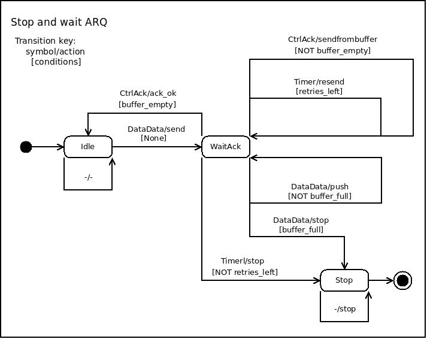

[GWN3, GNU Wireless Network 3](https://github.com/vagonbar/gr-gwn3)

# Stop and Wait FSM

This document describes how to integrate a Finite State Machine (FSM) into a block. FSMs are an effective and common tool to implement communications protocols, standard procedures for regulating data transmissions between computers and communications devices. Here we show how to implement the Stop and Wait protocol in GWN using an FSM. Stop and Wait is a usual protocol to ensure the data received is an exact copy of the data sent through an unreliable medium, such as air, where data may be distorted, arrive out of time, or be completely lost.


## The Stop and Wait protocol

Real world communications are not perfect: data may be distorted, lost, or arrive out of time. To ensure data is received exactly as it was sent, a number of communications protocols exist. One of the simplest ones is the Stop and Wait protocol.

From [Wikipedia](https://en.wikipedia.org/wiki/Stop-and-wait_ARQ):

After sending each frame, the sender doesn't send any further frames until it receives an acknowledgement (ACK) signal. After receiving a valid frame, the receiver sends an ACK. If the ACK does not reach the sender before a certain time, known as the timeout, the sender sends the same frame again. The timeout countdown is reset after each frame transmission. The above behavior is a basic example of Stop-and-Wait. However, real-life implementations vary to address certain issues of design. 


## Using an FSM in a GWN block

To implement a protocol or functionality using an FSM, the following steps are recommended:

    1. Carefully study or design the protocol or functionality to implement.
    2. Draw and describe the FSM: states, transitions, data required and necessary comments to make clear how everything works.
    3. Code your specific FSM using the FSM framework provided in the C{libgwn.fsm.gwnfsm} module.
    4. Wnenever possible, write test code for the FSM machine alone, not yet included in a block. An example FSM is shown in the C{libgwn.fsm.gwnfsm_test} module.
    5. Create a block to include your FSM in. The protocol implementation described in this document may serve you as a guide.
    6. Write a QA test to ensure your block and FSM work as expected in all possible circumstances.
    7. After your QA test works as expected, create the YAML file for your block and design a GRC flowgraph to show how it works. The QA test may be a basis for your GRC flowgraph design.
 

## The Stop and Wait FSM

The Stop and Wait protocol is implemented by the following Finite State Machine, the Stop and Wait FSM:



The FSM has the following states::

    - Idle : waiting for a message to arrive.
    - WaitAck : waits for a message {Type:Ctrl, SubType:ACK, seq_nr=sss} where sss is the sequence number of the last message emitted. Reception of this message confirms the successful arrival of the previously sent message to its destination.
    - Stop : the machine has stopped, no further action will be taken.


A description of transitions follows:

    - Idle, DataData/send [None], WaitAck : a message {Type:Data, SubType:Data, seq_nr:sss, ...} has been received. Action C{send} sends this message to its destination, keeps message in a buffer (memory) to resend if necessary, and starts a timeout to resend if ACK is not received before this timeout expires. There are no conditions to be satisfied. The FSM moves to WaitAck.
    - WaitAck, CtrlAck/ack_ok [buffer_empty], Idle : a message of {Type:Ctrl, SubType:ACK, seq_nr:xxx} is received. Function C{ack_ok} verifies if seq_nr received xxx is the same as seq_nr of the message last send, which confirms this message has been correctly received; this message was the first in the bufferM; it is extracted from the buffer. If there are no more messagees in the buffer, i.e. condition buffer_empty is True, the FSM moves to the Idle state.
    - WaitAck, CtrlAck/sendfrombuffer [NOT buffer_empty], WaitAck  : same as former transition, but after extracting acknowledged message from the buffer it is not empty (condition NOT buffer empty). Function C{sendfrombuffer} sends the now first message in the buffer, and starts timeout. The FSM remains in this state, now waiting for an ACK with sec_nr equal to the seq_nr of the first element in buffer.
    - WaitAck, Timer/resend [retries_left], WaitAck : a message {Type:Timer, SubType:Timeout} is received; this indicates the time to wait for an ACK has expired, and message is to be resent. Since only a some retries are allowed, condition retries_left is checked; if number of retries is less or equal than max_retries, funcrion C{resend} resends the first message is the buffer, increments the number of retries, and starts the timeout. The FSM remains in WaitAck state.
    - WaitAck, DataData/push, [NOT buffer_full], WaitAck : a data message is received, but ACK for last sent message has not yet been received, that is why present state is WaitACK. If buffer is not full (condition NOT buffer_full), function C{push} adds this new message at the end of the buffer. The FSM remains in WaitACK state.
    - WaitAck, DataData/stop [buffer_full], Stop : a new data message is received, but the buffer is full (condition buffer_full is True); message is ignored, function C{stop} prints a message, and the FSM machine moves to the Stop state.
    - Idle, -/- : a message which is not data is received; the message is ignored; no conditions to be met.
    - Stop, -/stop : a message of any kind is received, the FSM machine stops, and remains in Stop state.


The following registers must be kept::

    - retries : count number of retries in sending message.
    - max_retries : the maximum number of retries allowed for sending the same message.
    - timeout : the time to wait for an ACK before retrying sending the message.
    - buffer : memory, the C{mem} attribute of the FSM, to keep sent messages; the first message in buffer is the one ACK is waited for. 

Variables are implemented in a dictionary passed as a parameter to the FSM when constructed, and kept as an FSM attribute C{dc}. For example,

```
    dc = {'retries'=0, 'max_retries'=3, 'timeout'=0.2, ...}
```

The buffer is kept in the FSM attribute C{memory}, which may be implemented as a data structure according to the needs of the project. In the Stop and Wait protocol, the buffer is a First In First Out (FIFO) data structure, best implemented as a deque. In Python documentation for module [C{collections}](https://docs.python.org/3/library/collections.html#collections.deque) a deque is described as a "list-like container with fast appends and pops on either end". The following C{collections.deque} functions provide the necessary functionalities for a FIFO list::

    - C{appendleft(x} : adds x to the left side of the queue.
    - C{popleft()} : removes and returns the elment on the left side of the queue.

The size of the deque is obtaines with C{len(d)}, where C{d} is a deque. It is also possible to use a counter, incrementing it with each append and decrementing it with each pop.


## The Stop and Wait QA test

QA stands for Quality Assurance; it is usually a program to test a function or component of an application, or the application as a whole. This GWN Stop and Wait immplementation can be tested by running the program C{qa_stop_wait_send.py}.


## The Stop and Wait flowgraph

 


[Back to README](../../README.md)
